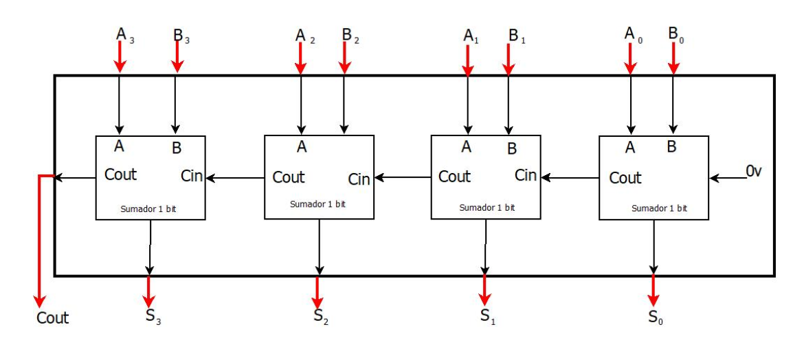

# lab01- implementación sumador de 4 bits

## Intrgrantes

* Sebastian Pérez Peñaloza
* Andres Cubillos Nieves

## Procedimiento

### Sumador de un bit

Para la implementacion de un sumador de 4 bits se utilizo el modulo `sum1bcc.v` dado por el profesor el cual consiste 
en un sumador de un bit completo *(contiene un carry de entrada y uno de salida)* que no fue diseñado apartir de compuertas
logicas como el modulo `sum1bcc_primitive.v` , si no utilizando registros para almacenar las entradas; esta implementacion es 
mas corta y mas sencilla de entender.

Para entender la logica del sumador de un bit se realiza la tabla de verdad de una suma binaria:  

En la tabla de verdad se puede ver que se necesitan tres entradas ***(A,B,Cin)*** y dos salida ***(Out,Cout)*** esto se puede de manera 
mas simple en el siguiente bloque funcional:

---

Para la creacion del modulo `sum1bcc.v` se declaran las tres entradas ***(A,B,Ci)*** y las dos salidas ***(Cout,S)***

~~~
	module sum1bcc (A, B, Ci,Cout,S);
	
		input  A;
  		input  B;
  		input  Ci;
  		
		output Cout;
  		output S;
~~~

Despues, como se dijo anteriormente se crea un registro de dos bits ***(st)*** y se asigna el bit menos significativo a la salida ***(S)***
y el mas significativo al Carry de salida ***(Cout)***  

~~~
		reg [1:0] st;

  		assign S = st[0];
  		assign Cout = st[1];
~~~

Para finalizar el modulo simplemente se crea un loop que realize constantemente la  suma de los las dos entras ***(A,B)*** y el carry 
de entrada ***(Cin)*** y se asigna el resultado a nuestro registro ***(st)*** para que se asigne el bit correspondiente a las salidas; el loop se
usa para realizar constantemente la operacion en caso de que se realicen cambios en las entradas

~~~
		assign st  = 	A+B+Ci;
 
  
	endmodule 
~~~

### Sumador de 4 bits

Ya con el sumador de 1 bit creado se inicia la implementacion de un sumador de 4 bits,el cual consiste en 4 sumadores de un bit funcinando en paralelo,
debido al tamaño de la tabla de verdad esta no sera ralizada pero se puede ver el bloque funcional para entender la implementacion del sumador

Como se puede observar se necesitan 8 bits de entrada ***(A0, A1, A2, A3, B0, B1, B2, B3)*** por lo que las combinaciones posibles seran 256 lo que hace 
complicado la creacion de la tabla de verdad, tambien se tendran 4 salidas y un carry de salida ***(S0, S1, S2, S3, Cout)***

---

Para la creacion del modulo `Sum4bcc.v` se utilizan 2 registros de entrada ***(xi, yi)***, uno de salida ***(zi)*** y una salida extra para el carry de salida ***(co)***

~~~
	module sum4bcc (xi, yi,co,zi);

		input [3 :0] xi;
  		input [3 :0] yi;
  		
		output co;
  		output [3 :0] zi;
~~~

Como se vio en el bloque funcional se necesitan 4 sumadores de un bit conectados por sus respecticos carry de entrada y salida

~~~
	wire c1,c2,c3;
  
	sum1bcc s0 (.A(xi[0]), .B(yi[0]), .Ci(0),  .Cout(c1) ,.S(zi[0]));
  	sum1bcc s1 (.A(xi[1]), .B(yi[1]), .Ci(c1), .Cout(c2) ,.S(zi[1]));
  	sum1bcc s2 (.A(xi[2]), .B(yi[2]), .Ci(c2), .Cout(c3) ,.S(zi[2]));
  	sum1bcc s3 (.A(xi[3]), .B(yi[3]), .Ci(c3), .Cout(co) ,.S(zi[3]));

	endmodule
~~~

Para crear una instancia de un modulo se coloca el nombre del modulo y a continuacion se le da el nombre a la instancia; por ejemplo para crear 
una instancia del modulo `sum1bcc.v` con nombre s0 se escribira la siguiente linea `sum1bcc s0`, a continuacion se enviaran los paramatros necesarios para que el modulo 
realice su funcion; en el caso del sumador de un bit son `module sum1bcc (A, B, Ci,Cout,S)`,para esto se coloca . seguido del nombre del parametro y entre parentesis en valor que 
se enviara `sum1bcc s0 (.A(xi[0]), .B(yi[0]), .Ci(0),  .Cout(c1) ,.S(zi[0]));`.

En el caso del carry de entrada y de salida de cada modulo ***(s0, s1, s2, s3)*** es necesario realizar la conexion vista en el bloque funcional, para este fin se crean tres cables
***(c1, c2, c3)***, en el caso del carry de entrada del primer modulo ***(s0)*** se envia el valor 0 ya que al ser el bit menos significativo no se conctara a un modulo anterior a el,
el carry de salida del primer modulo se conecta a carry de entrada del segundo modulo ***(s1)*** y se continua de esta forma hasta llegar al ultimo modulo ***(s3)*** en el cual se envia **co**
como carry de salida al no tener un modulo siguiente.
 
### TestBench

En este modulo se crean los estimulos de entrada permitiendo simular y obtener las salidas de los modulos, el TestBench del sumador de 4 bits sera `sum4bcc_TB.v`